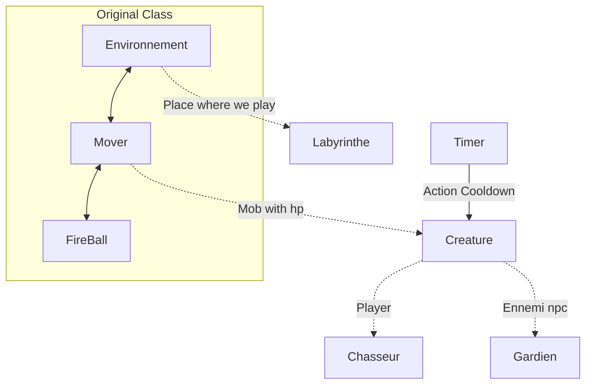

Rui CESISTA

# Report

Little diagram to represent my project \
dotted arrow is inheritance \
normal arrow is the class is an attribute of the class

# What has been done

I did all the base case.

- All the mob can shoot and lose hp when hit
- Win and lose condition
- Gardian shot in sight of player and return patrol mode when finish
- 

Labyrinthe can make a maze through a file enven though the maze need to be hard coded. \
I put a rotation system for the texture of the guards when I initialized them. \
\
I put a creature class to make  mob with hp for the gardien and the chasseur, there is a win and lose. \
\
For gardien and chasseur their shooting range depend of their health. \
\
There is a little problem in terms of shooting because when the guard is full health it shoots a little wrong. Also I think there is a problem with the direction angle when the gardien walk.
